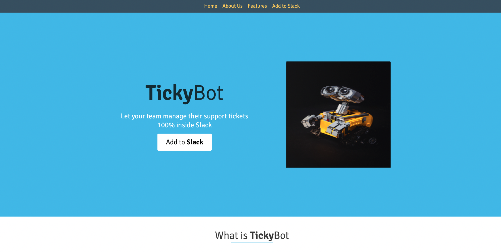

# TickyBot Clone

## Overview
This app was built for Chingu solo project requirement. This app helps to manage support tickets in Slack without the need of switching apps.

## Features
This app is seperated into different sections with a section explaining the basic concept and uses of tickybot. It also contains a section expalining how the app can be operated and how tickets can be opened and closed in slack via this app.

## Running The Project
The app has been lunched on github pages so it can be used live when you click on the link below. To run it locally, the code needs to be cloned from github then opened locally in browser.

## Deployed Link
[Deployed](https://daniel-ipymb.github.io/tickyBot_clone/)

## Screenshots
